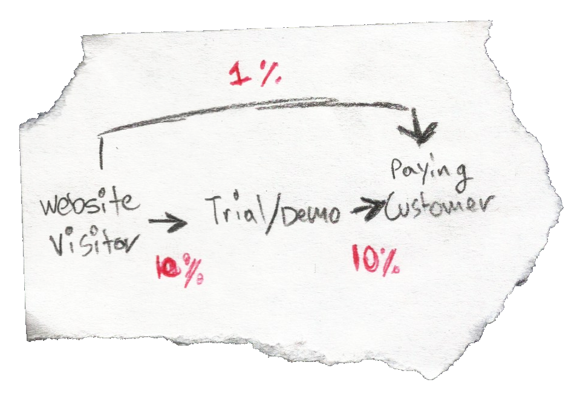
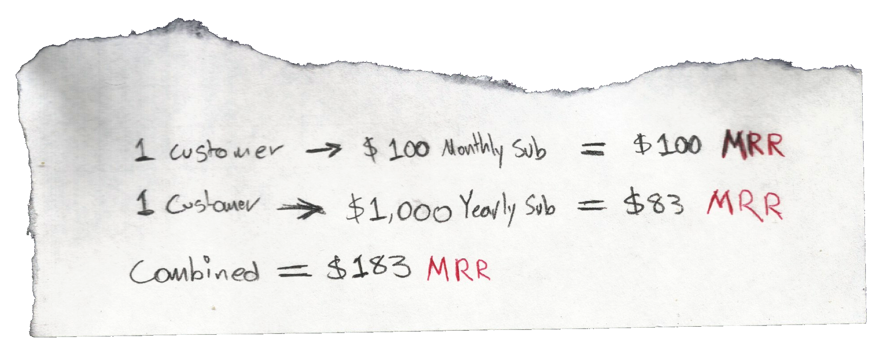
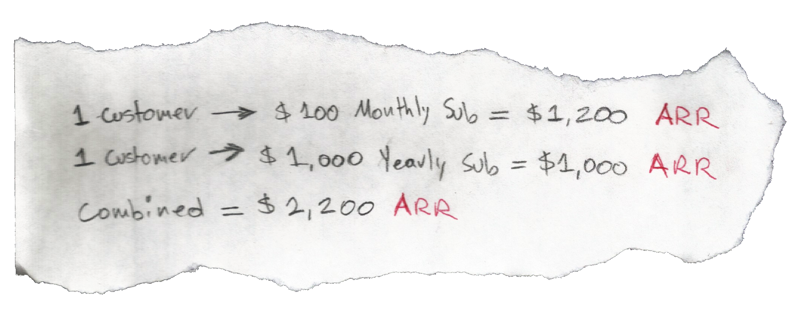
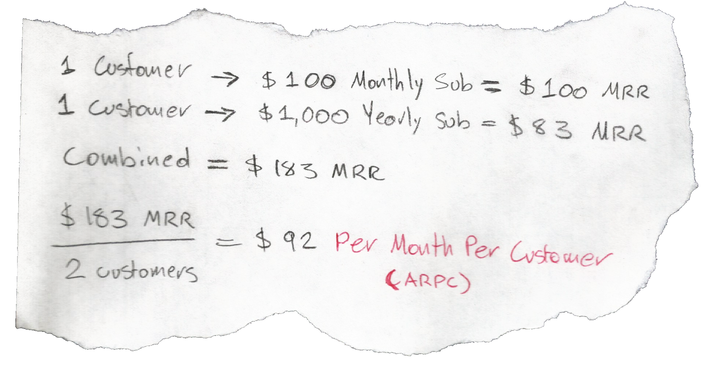
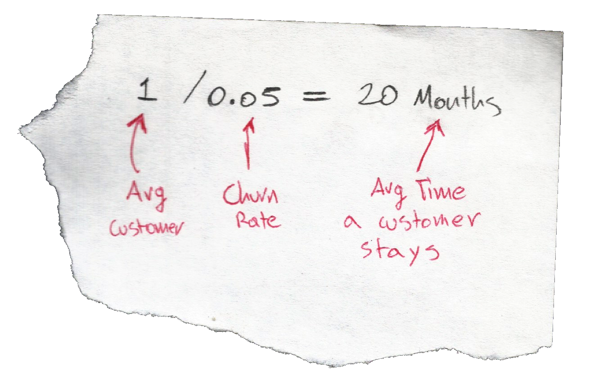
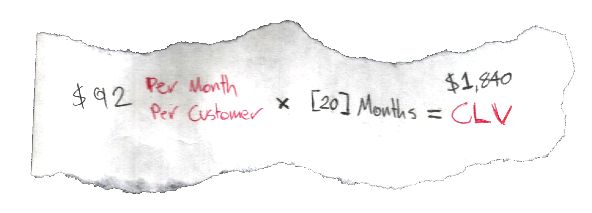
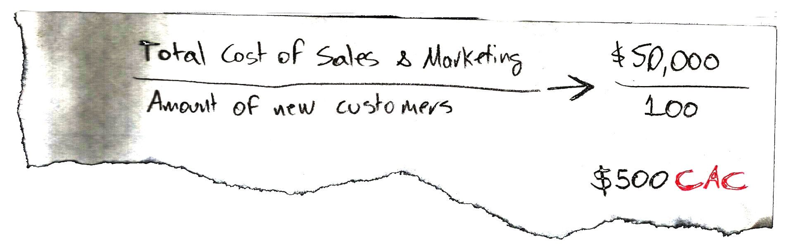

Some metrics are vital to __Software as a Service__ companies because they can tell us if we are in the right path, or if a change of heart is necesary. These particular metrics become relevant when we have a certain amount of data to work on, otherwise they might be impossible to determine or provide faulty insights. 

### Conversion Rate

Conversion rate is an important metric to consider when making a strategy (marketing, growth, etc.). We can get a conversion rate based on our __conversion funnel__. The __conversion funnel__ can be different for every company depending on the steps they want/have. These steps involve stages in the customer's journey, like visiting the website, contacting customer service, trying out a demo or even when they actually become paying customers. This conversion rate may be calculated with the current customer base, and the leads you have. The conversion rate might look like:

100 Paying Customers / 1000 Leads = 10% Conversion Rate

### Monthly Recurring Revenue (MRR)

__Monthly Recurring Revenue__ is what you can expect to earn at the end of each month. It's easier to determine when you have a subscription based model, since you can combine the MRR for every customer regardless if they are different (they could be different depending on which plan they bought, if they used a discount, if they bought it anually/monthly, etc.). MRR is an important metric to VCs, since it's growth indicates a stable income your business.

### Annual Recurring Revenue (MRR)

__Annual Recurring Revenue__ is like the __Monthly Recurring Revenue__ but considering how much the company would make a year.

### Average Revenue Per Customer (ARPC)
The __Average Revenue Per Customer__ determines how much our average customer impacts our revenue stream. We can calculate the __ARPC__ by either using __ARR__ or __MRR__ and dividing the revenue by the amount of customers.

### Arrition or Churn
Churn represents the rate at which customers stay with our business. We can obtain this rate by dividing the amount of customers that cancel by the total amount of customers. This is a very important metric, since it can also indicate if our product/service is actually bringing value (if we have a high churn rate, we might have a crappy product, bad prices, too complicated, etc.).

By obtaining the churn rate, we can easily calculate how much time on average a customer is going to stay with us.

### Customer Lifetime Value (CLV)

The key question for this metric is _"How much is an average new customer worth to your business?"_. To answer this question, we must decide how we will measure the revenue (monthly or annually) and find out how much time the average customer stays with us. As an example, we will use monthly revenue. To find how much time a customer stays with us, we have to calculate the __Arrition or Churn__.

This metric is important because it tells us how much are we able to spend comfortably before acquiring a new customer. For example, we just determined that we have a __$1,840 CLV__, so it wouldn't make much sense spending $2,000 on a new customer

### Customer Acquisition Cost (CAC)

The __Customer Acquisition Cost__ indicates how much we are spending on acquiring new customers. This metric becomes relevant to our marketing strategy, by telling us if our efforts are bearing fruit, or if we have something to fix.

### CLV to CAC Ratio

This ratio indicates how much valueable is a new customer, relative to how much we spend on acquiring it. The higher this ratio, the better. If the ratio is above 3, it can be considered as a good ratio.

### Reference

📺 [Important SaaS Success Metrics](https://www.youtube.com/watch?v=MpCJtMLKjgs)
