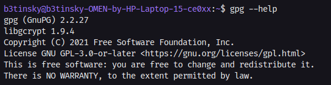
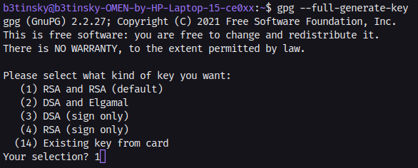
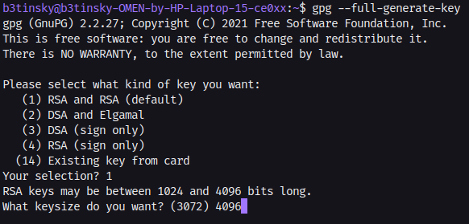
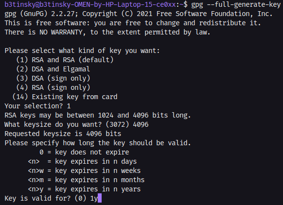

### Preface

You may be wondering, why is this even relevant? What is it for? What is a GPG Key Pair in the first place?

GPG stands for __GNU Privacy Guard__, and its a different implementation for a different encryption standard called __PGP (Pretty Good Privacy)__. GPG works to encrypt files or prove your identity, but the main reason im learning to use this, is because I want to sign my commits on Github.

### Installation

First we confirm that GPG is installed with:
```console
gpg --help
```

We should see something like this:


If you don't have it installed and are using a Debian derivative (if you're using something different, just use your default package manager), you could use:
```console
sudo apt-get install gnupg
```

Now let's just check if we already have some keys (because if we do, we might want to not mess with our existing keys, or start from scratch) by using:
```console
gpg --list-keys
```

If you get an __unsafe permissions warning__, use the following command on the folder expressed in the warning:
```console
chmod 0700 /tmp/gnupg/    <-- This was the folder given in the warning
```


### Creating the key

Now that we have successfully installed __gnupg__, we can move on to actually creating a key. We use the following command:
```console
gpg --full-generate-key
```
If everything went smoothly, we will see the following prompt:


Depending on your needs, you could pick a different type of key, but for now I will stick to the default (RSA and RSA (default)).



 We will then be asked how many bits do we want the key to be, ranging from 1024 to 4096. A lower bit count would make the key weaker and more susceptible to being cracked. In this case, I will choose the maximum of 4096 bits, even though it might take a little longer.



Now we have to set an expiration date. We could choose not to set an expiration date, but I consider it a good practice, since you never know what might happen in the future. Either way, we can always revoke a key or renew it, so don't feel pressured with this. In my case, I will choose a 1 year expiration date.
After that, enter and identification you would be comfortable with (name and email) and then just generate the key.

If everything went fine, we can confirm that our key was created by using a previous command:
```console
gpg --list-keys
```

### Backup and Restore
To backup your keys, use the following command (it will export it to your current directory):
```console
gpg --export-secret-keys --output <The name you provided>.gpg --armor <The email you provided>
```

Or you could also copy the entire folder where the key is (it is most likely to be at /tmp/gnupg) and paste it in the same location when you want to restore it. 

### Getting your public key for Github
Now that we have our key pair, we need our public key so we can give to Github and start signing our commits. To do this, we run the following command:

```console
// --armor makes the output in plain text instead of binary

gpg --export --armor <The email you provided>
```

### Caching our passphrase
It may be annoying to enter our passphrase every single time we do a commit, so we can cache it for a certain amount of time. To do this, we must go into our __gnupg folder__:
```console
cd ~/.gnupg
```
And create a file called __gpg-agent.conf__:
```console
// This is a daemon that runs on your system

touch gpg-agent.conf
```
Now, inside the file, define the following values:
```output
// These are defined in seconds. This would amount to 1 week

default-cache-ttl 604800
max-cache-ttl 604800
```

### Extra functions
- Editing the key (mostly expiration date)
- Changing gpg passphrase
- Creating a revoke certificate to revoke on demand

### Reference
📺 [Creating and Managing a GPG Key Pair](https://www.youtube.com/watch?v=1vVIpIvboSg)