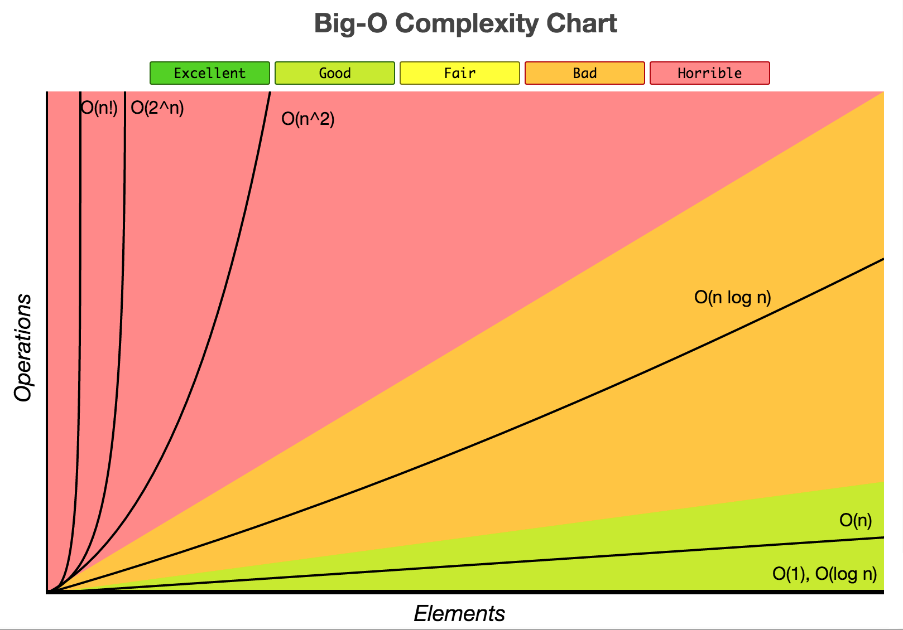

At first running our code may seem like a trivial task as in "Compile -> Run -> Hackerman", and that is probably because at the beginning of our careers, we don't worry about big programs (which come with big problems) or about the computer taking to long processing our code. 
As we feel more and more comfortable, we begin to explore more complex topics and harder problems, and sometimes our code and practices can't keep up. We notice how code was compiled in a blink of an eye, but now it takes some seconds or even minutes, and thats because it did not scale.
It's harder answering questions like "How much time does it take to run this?" because there are so many factors involved, like:

- How fast is your computer?
- Do you have other programs running?
- What is the size of the input?

The __size of the input__ represents the n. When talking about the speed of our code running, we have to see (if possible with a graph) how it will scale with bigger sizes of n. This way, we can see if our code will be able to handle bigger inputs.



Some of these patterns can also be described in a more casual way, like linear, constant or quadratic, but it will always be better if we can describe it in Big O Notation, since its more systematic.

```output
Linear Time    -> O(n)
Constant Time  -> O(1)
Quadratic Time -> O(n^2)
```

But how can we know that Linear Time is O(n)? How can we be certain that they are correctly represented?
Looking at the graph of our code's performance can be of great help, because just by looking at the shape we can get an idea of how it will scale.
But what if we don't have software that helps us map our code's performance to a graph?
We can still prove time complexities with math.
```console
Proving Linear Time is O(n)
    
// The equation for a linear graph is y = mx + b

T = an + b

1. Find the fastest growing term
If we were to increase any of those two terms, 
for example by 2, we can see that (b) does not
grow (remember that n relates to changing input size),
so (an) is the fastest growing term.

2. Take out coefficient
We would take out the (a) out of (an) since it is a constant,
and (n) is not.

3. Result
Now we are left with:
O(n)
```
This is not the formal mathematical way of doing it, but for practical purposes its good enough. It works the same with constant and quadratic time.

This way of doing it is good if we have time and a lot of interest in the subject, but usually we lack one of these (almost always its lack of time), so you might me asking "Do I really have to do all this just to know the time complexity of my code?", and the answer is kinda 🤷🏻‍♂️.

Instead of doing experiments every single time, we can calculate the time complexity of individual lines of code and then add them up.

### Constant

```python
def constantFunction(array):
    total = 0                               O(1)
    return total                            O(1)
```
In a function like the one above, there is not much going on, since only a variable is delcared and then its returned. This means that no matter the size of the array passed to the function, it will always remain the same (including the time needed to run).
```output
   T = O(1) + O(1) 
     = c1 + c2              // They are both constants
     = c3                   // They remain a constant
     = c3 x 1               // The sum is multiplied by the time, which is 1    
     = O(1)                 // which ends up being constant time
    
    O(1) + O(1) = O(1)
```
### Linear
```python
def linearFunction(array):
        total = 0                     O(1)
        for each i in array:            
            total += i                O(1) For each i
        return total                  O(1)
```
This function is a bit different, since here we still have the constant times of declaring a variable and returning it, BUT now we have a loop that adds to the variable, so in this case, the size of the array does matter, because the bigger the array, the more additions that will have to be made.
```output
T = O(1) + n x O(1) + O(1)
  = c1   +  ...     + c2
  = c3   + n x c4      // Same process of finding faster term
  = O(n)
```
### Quadratic
```python
array =[[1,2,3],        or          array = [[1,2,3,4],
        [4,5,6],                            [5,6,7,8],
        [7,8,9]]                            [9,10,11,12],
                                            [13,14,15,16]]
    
def quadraticFunction(array):
    total = 0                               O(1)
    for each row in array:      
        for each i in row:
            total += i                      O(1)
    return total                            O(1)
```
This function behaves in a similar manner to the linear one, but the crucial difference is that when doing the additions, more work is involved. Every line must be checked, and every element within it must be as well. Even though the addition is still in O(1) time complexity, it is nested within two loops inside this nxn array.
```output
T = O(1) + n^2 x O(1) + O(1)
  = c1   +    ...     + c2
  = c3   + n^2 x c4
  = O(n^2)
```