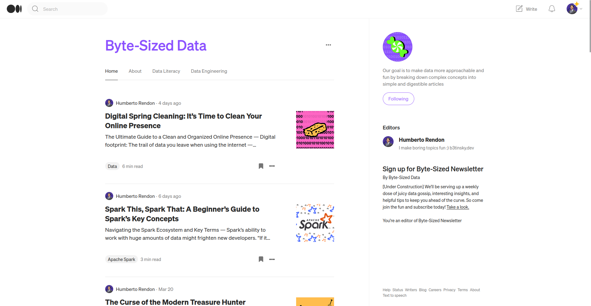
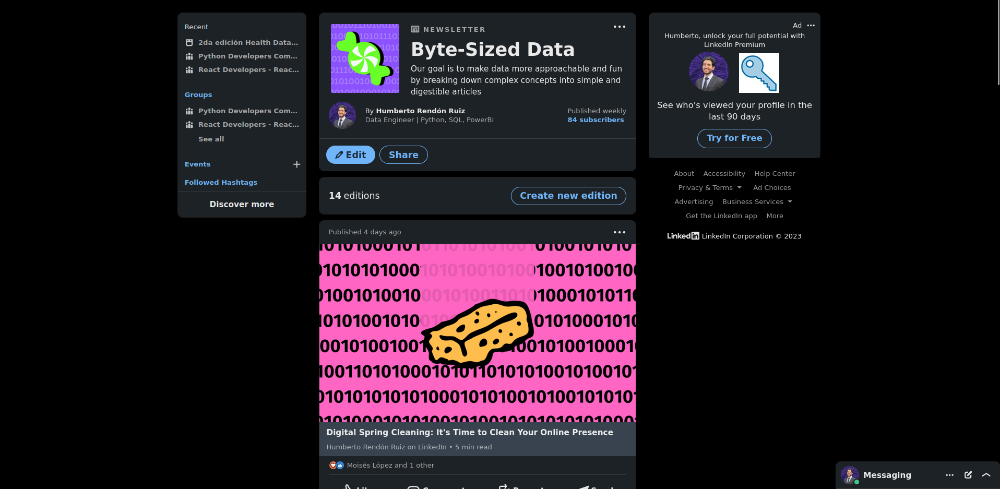

The world of data is a big one. Wrapping my head around it was overwhelming to say the least. I did a lot of courses, read books, articles and listened to podcasts. At some point, it started to feel ephimeral. All this knowledge dissolving with time. To counter that, I decided to start a blog. I use my blog as if it were my notebook. Everytime I'm reading a book or learning about a new technology, I make "notes" in that blog. That way, not only am I learning, but also helping other people while building my personal brand.

Currently the blog is available on Medium and as a LinkedIn Newsletter.

[Medium Blog](https://medium.com/byte-sized-data)

[LinkedIn Newsletter](https://www.linkedin.com/build-relation/newsletter-follow?entityUrn=7033551567337242625)