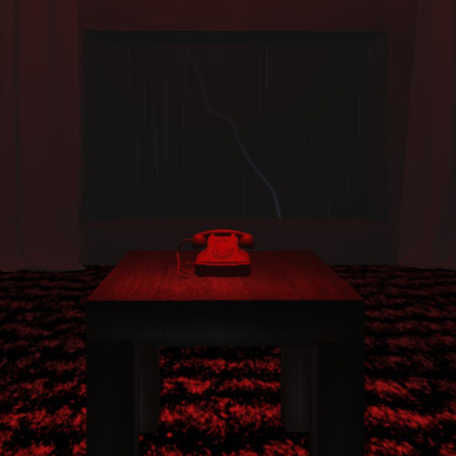
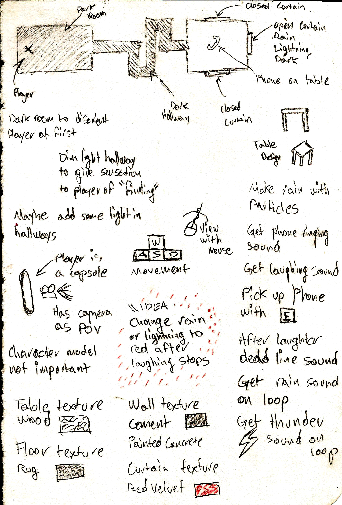

This project was developed for my "Computer Graphics" class. The purpose was using a *visual* technology and then exporting the result in a web format. We had the option of using WebGL, i3, p5 or Unity. I decided to use Unity because I wanted to create something more interactive, since the examples of previous projects our professor gave us were mostly to "look at". Its written in C# and exported to WebGL with the HTML option Unity provides.

Its a short horror experience where you travel through a small and scary building with ghosts to find out who is calling at this ungodly hour.

This is my design/doodles of how I imagined the idea before creation

### Try it out!
(For a better experience use headphones and turn off the lights)
https://b3tinsky.itch.io/computergraphicsproject-a01039636