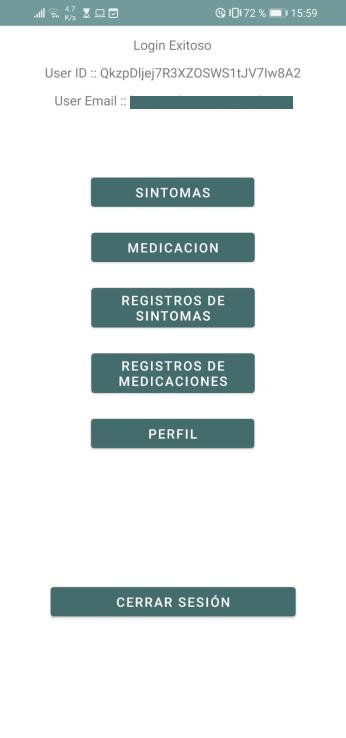
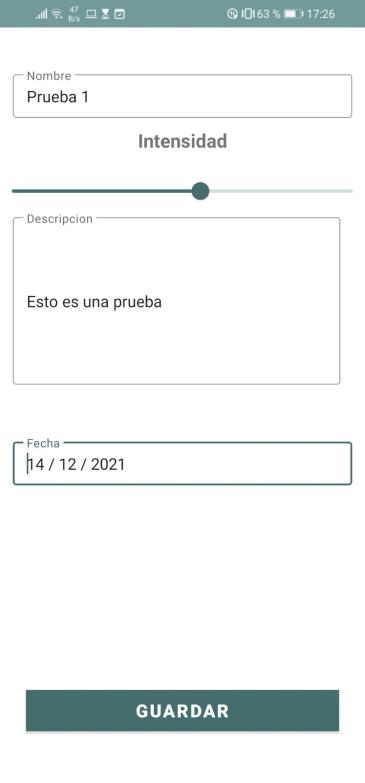

This project was developed as a requirement for my "Mobile Application Development" class. It was made in teams, and I was responsible for the application's front end. We used Kotlin for the front end and Firebase for the backend. 
The purpose of the application was to help a local doctor with his patients. He explained to us how many of his patients came in worried about having covid because they presented some symptoms. The doctor was worried that his patients could catch covid or transmit it to others by needlessly going to his office, but at the same time he didn't want to take an eye off his patients in case they were actually developing the virus.
The app allows a patient to report daily how they feel regarding certain symptoms, and if they used any type of medicine. The data is then stored in a database that allows the doctor (and some of his colleagues) to know if a patient is getting worse, if it has something to do with what the patient is taking or if the patient is getting better, with out the need to expose others.

### How it works

- __Sintomas__: List of your symptom updates
- __Medicacion__: List of your medicine intakes
- __Registro de Sintomas__: Report symptoms
- __Registro de Medicaciones__: Report medicine intake
- __Perfil__: User details
- __Cerrar Sesion__: Log out

- __Nombre__: A title that represents your symptom
- __Intensidad__: A slider bar that represents how intense you feel this symptom. The doctor told us that the representation for the intensity should not be a whole number, because the patients were unable tu accurately describe the intensity with a complete number
- __Descripcion__: Gives detail about the symptom
- __Fecha__: When did the symptom appear?
- __Guardar__: Save the symptom report